<div align="center">

# Blood-Transport UAV — Joints & Fairings

### Every structural interface that holds the aircraft together, and every aerodynamic surface that covers them

**AVDASI 2 · University of Bristol · Department of Aerospace Engineering · 2024–25**
Albatross Aviation (Company A) · Team 08 · Fuselage Division


</div>


<div align="center"><sub><b>Full-vehicle CAD assembly.</b> The pink structure over the wing root is the Fus-MWP fairing; the joint beneath it, the empennage joint at the tail and every fairing on the aircraft are this team's work.</sub></div>

---

## The brief

Design, build and test a UAV capable of moving blood samples rapidly between a rural short
tarmac runway and a hospital test centre — the outbound leg is time-critical, the return by
road is not. Sixty students, three competing companies, one academic year, and a real test
campaign at the end: a wind tunnel entry for aerodynamic data and a load test taken past
the ultimate load case.

Team 08 owned the **joints and fairings** — every structural interface that holds the
aircraft together, and every aerodynamic surface that covers those interfaces. That put us
downstream of six other teams and upstream of the whole airframe: **nothing assembled until
our parts fit.**

**My role:** Fuselage Division Design Team Manager, Team Project Manager, Aero Specialist
and Design Specialist. → [What I personally did](docs/my-contribution.md)

---

## Results at a glance

| | |
|---|---|
| **Ultimate load test** | Survived to **813 N**, past the required ultimate load case |
| **Load response** | Linear throughout — **74 N/mm** centre, **102 N/mm** empennage, no stiffness knee |
| **Governing reserve factor** | **1.95** — 22.2 mm centre bar in bending, at 6g × 1.5 |
| **Observed failure** | Bolt shear-out through the PLA main wing clamp — *an unmodelled path* |
| **Wind tunnel** | 20 m/s; fairings added **+0.09 N** drag, inside the 0.34 N run-to-run scatter |
| **Subassembly mass** | **1,011 g** across 10 parts; fairings were 11.85% of all-up UAV mass |
| **Parts delivered** | 10 flight parts, 100% additively manufactured |

<table>
<tr>
<td width="50%"></td>
<td width="50%"></td>
</tr>
<tr>
<td><sub><b>Eight reserve factors</b>, critical member highlighted. The centre bar at 1.95 was the predicted first failure.</sub></td>
<td><sub><b>Linear to ultimate load</b> — no knee, no progressive softening. The strongest single result in the project.</sub></td>
</tr>
</table>

**The headline engineering result is the gap between two rows of that table.** The stress
work predicted the centre bar would go first. It didn't — the aircraft failed somewhere the
analysis never looked, because no reserve factor had been computed for any 3D-printed part.
That finding, and what it says about where analysis boundaries get drawn, is the most useful
thing in this repository. It is worked through in
[**Structural analysis**](docs/04-structural-analysis.md) and
[**Test campaign**](docs/07-test-campaign.md).

---

## The aircraft

<table>
<tr>
<td width="33%">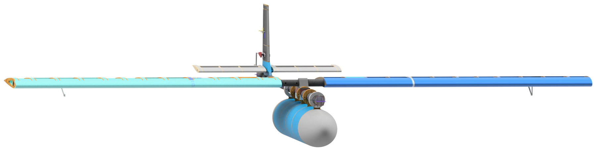</td>
<td width="33%">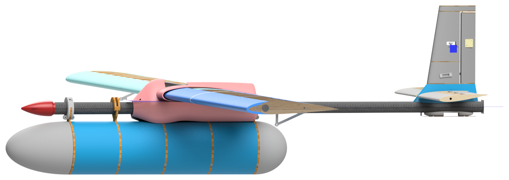</td>
<td width="33%"></td>
</tr>
<tr>
<td align="center"><sub>Front</sub></td>
<td align="center"><sub>Side</sub></td>
<td align="center"><sub>Isometric</sub></td>
</tr>
</table>

A 535-file Inventor assembly, including other teams' geometry so the top-level assembly
resolves. Authorship is attributed per-tree in [`cad/README.md`](cad/README.md).

---

## What this team designed

Ten flight parts across two families: **structural joints** that carry load between major
assemblies, and **aerodynamic fairings** that cover the interfaces those joints create.

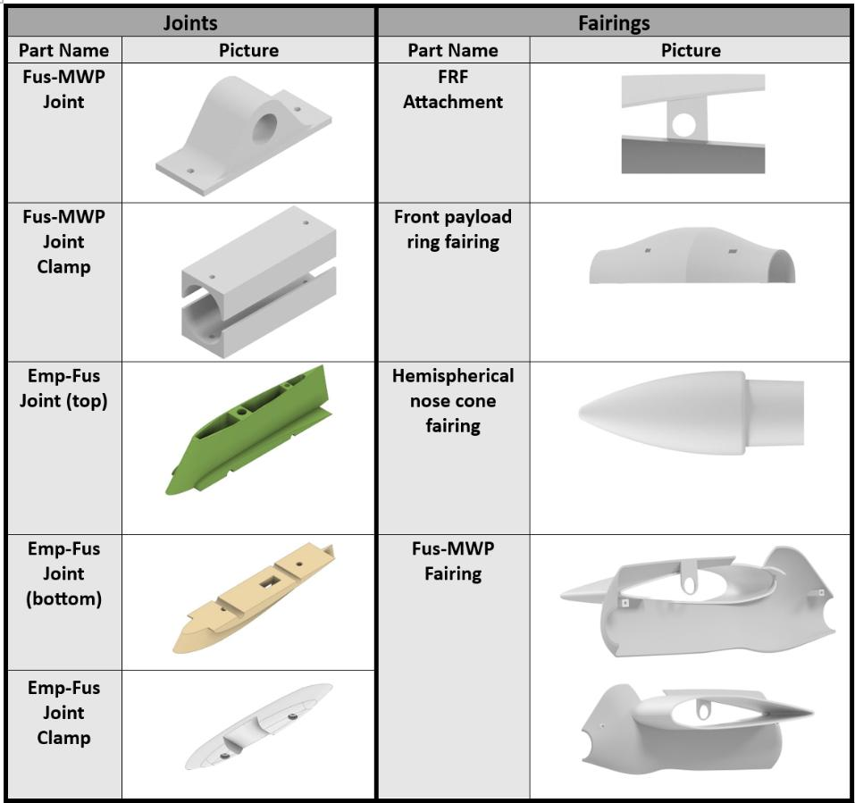

<sub><b>The delivered part catalogue.</b> Every part on this sheet was designed, printed, fitted and flown by Team 08.</sub>

### Structural joints

<table>
<tr>
<td width="50%">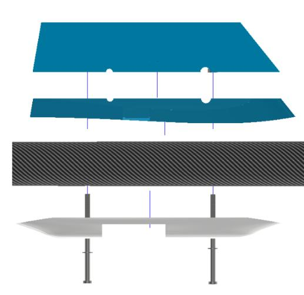</td>
<td width="50%">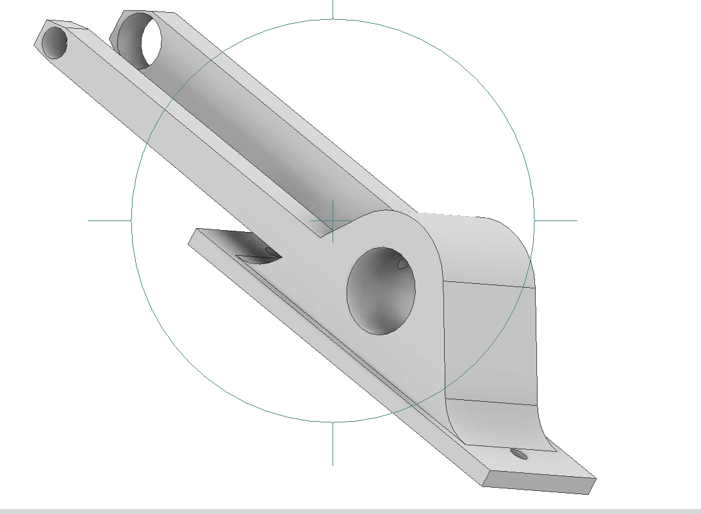</td>
</tr>
<tr>
<td><sub><b>Empennage–fuselage joint, exploded.</b> Load passes predominantly into the CFRP fuselage spar, which is sized for it — so the unreinforced PLA joint is acceptable at these load cases.</sub></td>
<td><sub><b>The joint as a single part.</b> Brass inserts take the fasteners; these could work loose under significant lateral load, which the structural test never applied.</sub></td>
</tr>
</table>

<table>
<tr>
<td width="50%">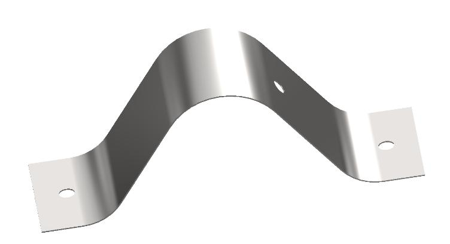</td>
<td width="50%">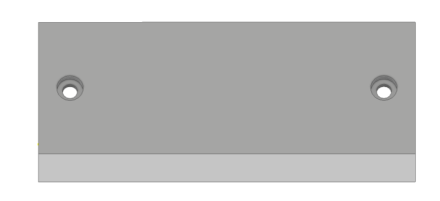</td>
</tr>
<tr>
<td><sub><b>Formed 2014A-T3 aluminium strap.</b> This is what protects the <i>upper</i> half of the Fus-MWP joint — load passes into metal and away from the printed plastic.</sub></td>
<td><sub><b>The clamp counterbore.</b> The <i>lower</i> clamp has no such protection, and bolt forces bear directly on PLA. This asymmetry is the direct cause of the eventual failure.</sub></td>
</tr>
</table>

> **The load-path asymmetry above is the whole story of this project in one pair of images.**
> The top half of the joint was protected by metal. The bottom half was not, and nobody
> modelled it.

### Aerodynamic fairings

<table>
<tr>
<td width="50%">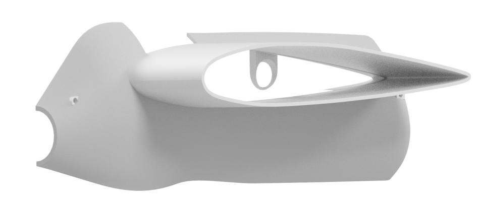</td>
<td width="50%">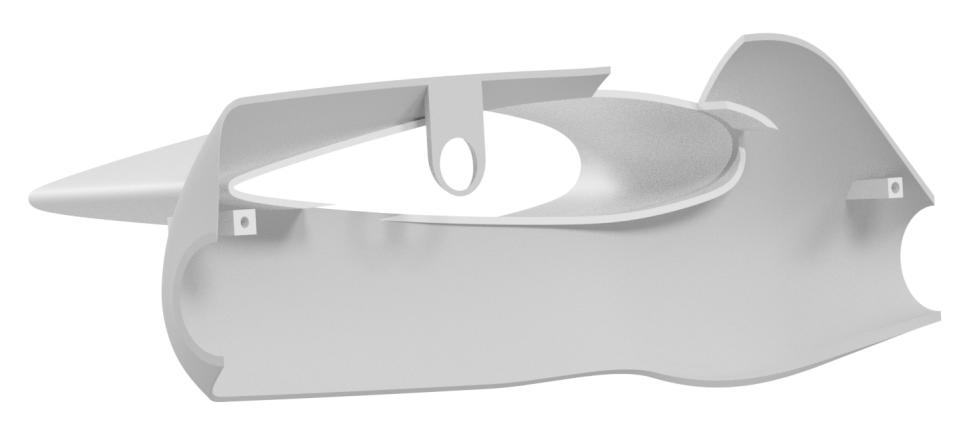</td>
</tr>
<tr>
<td><sub><b>The Fus-MWP fairing.</b> Shaped to the same <b>NACA 2414</b> section the wing teams used, so the covering is continuous with the wing it meets.</sub></td>
<td><sub><b>Planform.</b> Maintains laminar flow as far aft as possible and minimises abrupt contour changes.</sub></td>
</tr>
</table>

<table>
<tr>
<td width="50%">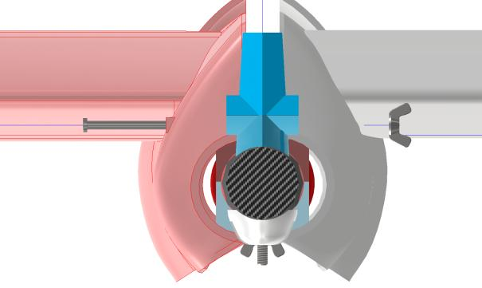</td>
<td width="50%">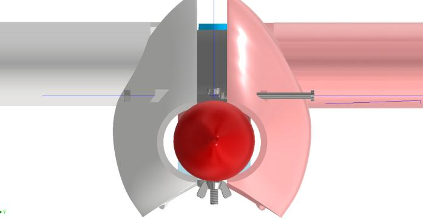</td>
</tr>
<tr>
<td align="center"><sub>Fairing assembly, front</sub></td>
<td align="center"><sub>Fairing assembly, rear</sub></td>
</tr>
</table>

**Why cover anything at all?** The exposed items were the payload rings, the main wing
joint, and roughly **100 mm of cylindrical wing spar**. Using Cayley's minimum-drag shape,
a circular section in 2D produces on the order of **ten times** the drag of an aerofoil
section of the same thickness. A bluff cylinder in clean air is close to the worst thing
that can be left on an aircraft.

But a fairing *adds wetted area*, which adds skin friction — so it is only worth fitting if
it removes more form drag than the friction it introduces. That tension is the central
design argument, set out in full in [Aerodynamics](docs/05-aerodynamics.md).

---

## Concept selection

Before any of the above existed, candidate concepts were scored against weighted criteria.

<table>
<tr>
<td width="50%">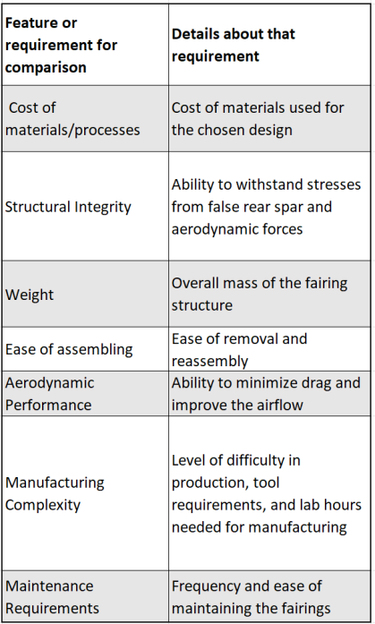</td>
<td width="50%">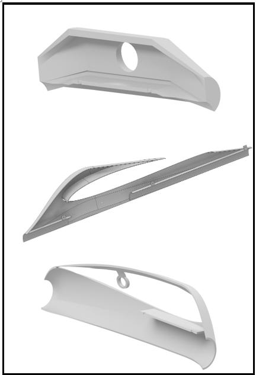</td>
</tr>
<tr>
<td><sub><b>Pairwise criteria weighting</b> feeding a multi-criteria decision analysis.</sub></td>
<td><sub><b>The designs that lost.</b> Kept deliberately — a downselection with no visible rejects is not a decision, it is a preference.</sub></td>
</tr>
</table>

Requirements were tracked to a traceability matrix throughout:


→ [Brief & requirements](docs/01-brief-and-requirements.md) · [Concept selection](docs/02-concept-selection.md)

---

## Structural analysis

All checks were run at **6g** with the standard aerospace **1.5** factor on top —
$F_{\text{design}} = 6 \times 1.5 \times F_{1g} = 9 \times F_{1g}$ — and completed in
teaching block 1, **deliberately ahead of detailed design**, so the design team had limits
to work inside rather than an audit to fail afterwards.

<table>
<tr>
<td width="50%">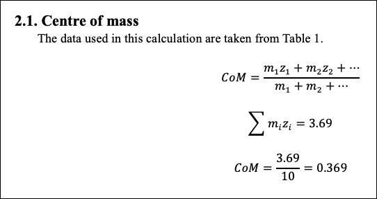</td>
<td width="50%">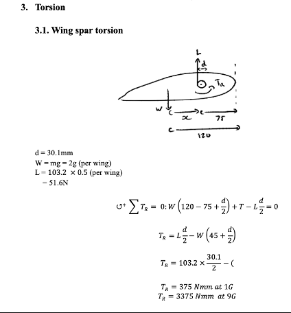</td>
</tr>
<tr>
<td><sub><b>Centre of mass</b> across all subassemblies, cross-checked with the other teams: 0.369 m.</sub></td>
<td><sub><b>Root torsion.</b> Weight acting 120 mm from the leading edge, lift at the rear of the spar: 375 N·mm at 1g, 3375 N·mm at 9g.</sub></td>
</tr>
</table>

| Part | Check | RF |
|---|---|---|
| **Centre bar** | **Bending** | **1.95** |
| Spar | Bearing | 2.4 |
| Flange | Prying | 3.4 |
| Spar | Tension | 4.4 |
| Spar | Shear | 5.1 |
| Pin | Shear | 7.4 |
| Spar | Cleavage | 8.9 |
| Lug | Prying | 39.0 |

Two things in this table are worth more than the pass/fail verdict. The **1.95** is the
design point — conservative by construction, and the predicted first failure. The **39.0**
is a defect: a reserve factor that high is 39× more material than the load requires, and on
a vehicle where mass drives take-off performance that is an unclaimed mass saving. It went
unclaimed.

### Where the mass went

<table>
<tr>
<td width="50%">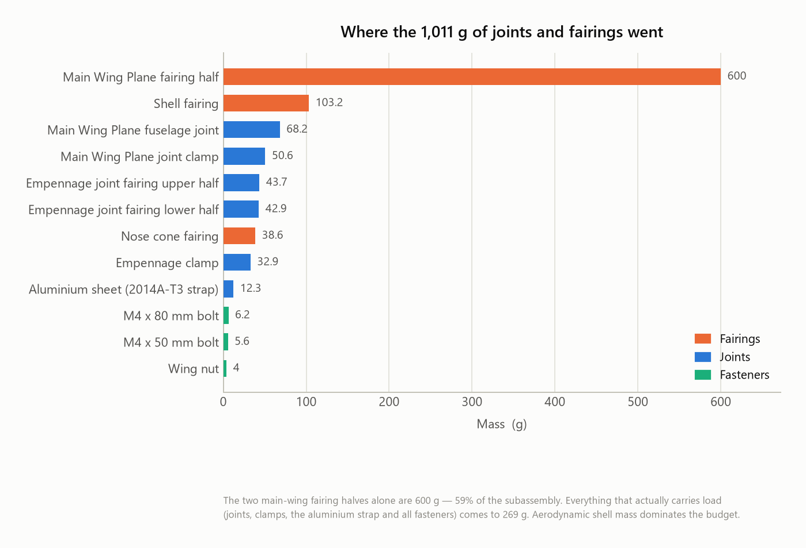</td>
<td width="50%">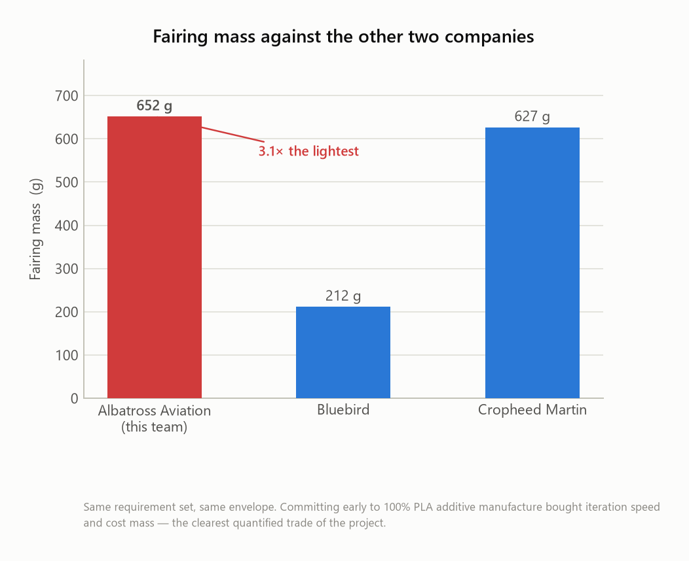</td>
</tr>
<tr>
<td><sub><b>1,011 g total</b> — but only <b>269 g carries load</b>. The other <b>742 g is aerodynamic shell</b>.</sub></td>
<td><sub><b>3.1× the lightest competitor.</b> All fairings came to 652 g, 11.85% of all-up UAV mass.</sub></td>
</tr>
</table>

The cause was a single early decision: **commit entirely to FDM PLA.** That bought fast
iteration and complex compound curves, both of which the project genuinely needed given how
much the interfaces moved. It cost mass. What makes it a real error rather than an accepted
trade is that **some parts never changed** — the nose cone fairing was stable from early on
and could have been Styrofoam at no schedule risk.

→ [Structural analysis in full](docs/04-structural-analysis.md)

---

## Aerodynamics

At the tunnel speed of 20 m/s: $Re = 4.11 \times 10^5$, $M = 0.058$. Compressibility is
irrelevant, so any drag measured is viscous or form drag — but $Re \approx 4 \times 10^5$ is
low enough that transition is sensitive to surface finish and freestream turbulence, which
is why XFoil and the tunnel were never going to coincide.

<table>
<tr>
<td width="50%">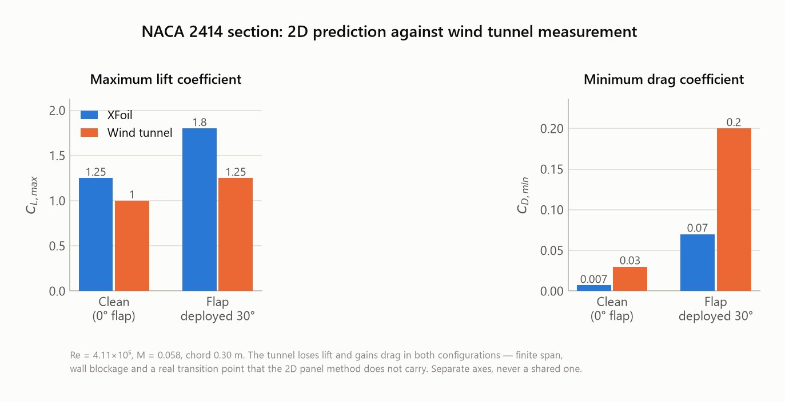</td>
<td width="50%">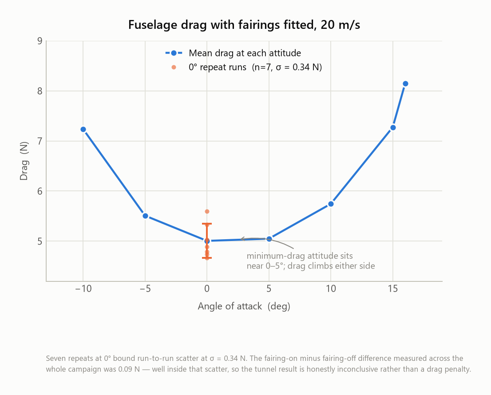</td>
</tr>
<tr>
<td><sub><b>XFoil vs wind tunnel</b>, clean and 30° flap. The tunnel loses lift and gains drag in both configurations — consistently, and in the expected direction.</sub></td>
<td><sub><b>Fuselage drag vs angle of attack</b>, with the seven-run 0° repeat scatter that decides how much of this is signal.</sub></td>
</tr>
</table>

| Configuration | Source | C<sub>L,max</sub> | C<sub>D,min</sub> |
|---|---|---|---|
| Clean, 0° flap | XFoil | 1.25 | ~0.007 |
| Clean, 0° flap | Tunnel | **1.00** | **0.030** |
| Flap 30° | XFoil | 1.80 | 0.070 |
| Flap 30° | Tunnel | **1.25** | **0.200** |

**The conclusion is not that XFoil was wrong** — it answered its own question correctly. A
2D, infinite-span, smooth-surface model is a *lower bound on drag and an upper bound on
lift*, and should be read as such. The dominant discrepancy is finite span: tip vortices
generate induced drag and shed bound circulation, a term entirely absent from a 2D solution.

<details>
<summary><b>Original drag polars</b> (click to expand)</summary>

<table>
<tr>
<td width="50%">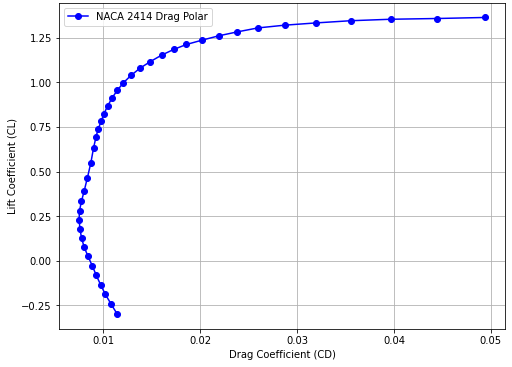</td>
<td width="50%">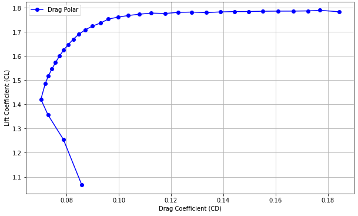</td>
</tr>
<tr>
<td align="center"><sub>XFoil, clean</sub></td>
<td align="center"><sub>XFoil, 30° flap</sub></td>
</tr>
<tr>
<td>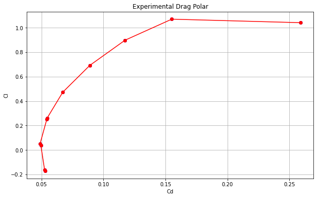</td>
<td>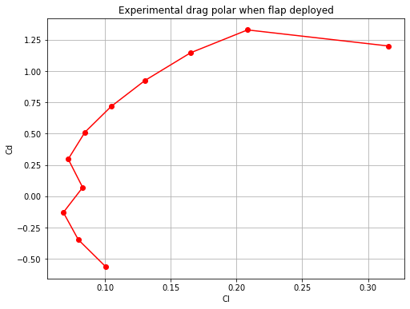</td>
</tr>
<tr>
<td align="center"><sub>Tunnel, clean</sub></td>
<td align="center"><sub>Tunnel, 30° flap</sub></td>
</tr>
</table>

</details>

### Did the fairings work? The tunnel could not say.

Averaged over the campaign, fairings-on recorded **0.09 N more drag** than fairings-off.
Seven repeat runs at 0° give a run-to-run standard deviation of **σ = 0.34 N** — so the
measured difference is about a quarter of one standard deviation of the measurement noise.
**It is not a resolvable difference.**

<table>
<tr>
<td width="50%">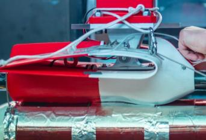</td>
<td width="50%">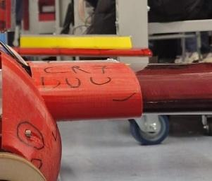</td>
</tr>
<tr>
<td><sub><b>The vertical cutout</b>, added so the fairing would clear the tunnel mounting hardware. A feature added purely for testability degraded the quantity being tested.</sub></td>
<td><sub><b>The exposed spar section.</b> With no wings fitted, the fairing's flanks were open and flow crept inside — a condition that cannot occur on the assembled aircraft.</sub></td>
</tr>
</table>

**The test was structurally biased against the part.** The tunnel could only accommodate the
fuselage, which removed the single largest justification for the fairing — the 100 mm of
exposed spar — from the experiment entirely, while the fairing's cost in extra wetted area
was fully present.

So: **experimentally inconclusive; theoretically the fairing should still reduce drag in
real operation.** A large form-drag benefit was traded for a friction penalty that proved
too small to measure. Closing this properly needs a test with wings fitted, or validated
CFD. Neither was available — and CFD was rejected honestly, because a result nobody on the
team could defend is worse than no result.

→ [Aerodynamics in full](docs/05-aerodynamics.md)

---

## Test campaign

Three events, each answering a different question.

| Test | When | Question | Result |
|---|---|---|---|
| Graphite Goose | TB-1 | Do the joints work as predicted at limit load? | Pass — behaved as analysed |
| Ultimate load test | 5 Mar 2025 | Does the airframe survive past ultimate load? | Pass to **813 N**, then failed in an unpredicted mode |
| Wind tunnel | TB-2 | Do the fairings reduce drag? | **Inconclusive** — the configuration could not answer it |

<table>
<tr>
<td width="50%">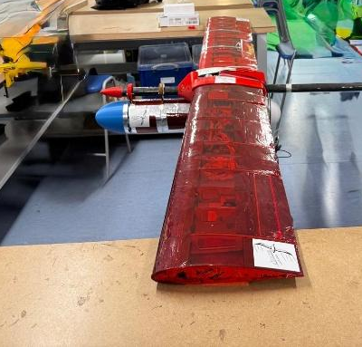</td>
<td width="50%">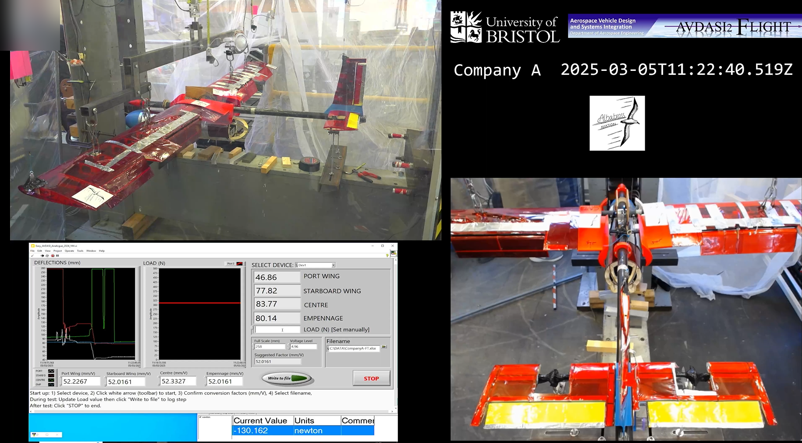</td>
</tr>
<tr>
<td><sub><b>The practice build.</b> Nothing assembled until our parts fitted, so a trial assembly was not optional.</sub></td>
<td><sub><b>Load test station, 5 March 2025.</b> The loaded airframe in the rig, LabVIEW deflection channels at port wing, starboard wing, centre and empennage.</sub></td>
</tr>
</table>

### Then it failed somewhere else

Sensors were removed after ultimate load was reached, to protect them. Loading continued.
The recorded load went **813 N → 804 N → 764 N**. A load drop with no visible or audible
event means something has yielded — but nothing was obvious from outside, so the aircraft
was disassembled and inspected.

**The centre bar — RF 1.95, the predicted failure point — was undamaged.** It was inspected
specifically because it was expected to fail, and showed no deformation at all.

<table>
<tr>
<td width="33%">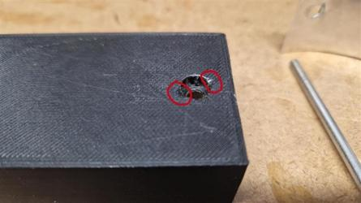</td>
<td width="33%">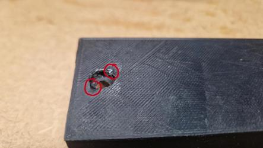</td>
<td width="33%">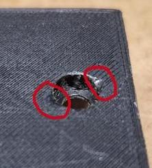</td>
</tr>
</table>

<sub><b>Bolt shear-out through the PLA main wing joint clamp.</b> The wing nut has pulled down into the counterbore cavity and the bolt has begun working through the remaining thin section of printed plastic.</sub>

### Two causes, and neither is arithmetic

**1 · The analysis had no term for this mode.** No reserve factor was ever computed for any
3D-printed part. Every check in the table above is a check on a metallic member — the
aluminium centre bar, the CFRP spar, the aluminium strap and its fasteners. Printed PLA
components were treated, per requirement 2.5.2.a, as non-structural formers. This is a
**scoping** failure, and a common one in practice: the analysis boundary was drawn around
the parts the method knew how to handle, and never revisited when a printed part ended up in
a primary load path.

**2 · The wrong clamp was fitted.** Two variants existed *deliberately* — a wind tunnel
clamp with an 8 mm counterbore for a flanged bronze bush, and a structural test clamp with
solid material under the wing nut. The **wind tunnel clamp was fitted for the structural
test**, because swapping it meant disassembling the pod and there was not enough time. The
aircraft was loaded with a cavity directly beneath the wing nut.

> **The design anticipated this problem and solved it. Build configuration control did not
> carry the solution through to the day.** The correct part existed and was not fitted.

Both things are true at once: the predictions that *were* made were sound — linear response
to ultimate load and an undamaged centre bar confirm the whole analysis chain — and the
predictions did not cover the aircraft. Correct answers to the wrong question.

→ [Test campaign in full](docs/07-test-campaign.md)

---

## Project management

I ran the Fuselage Division design team and the team project plan, so the planning artefacts
are part of the engineering record rather than an appendix to it.

<table>
<tr>
<td width="50%">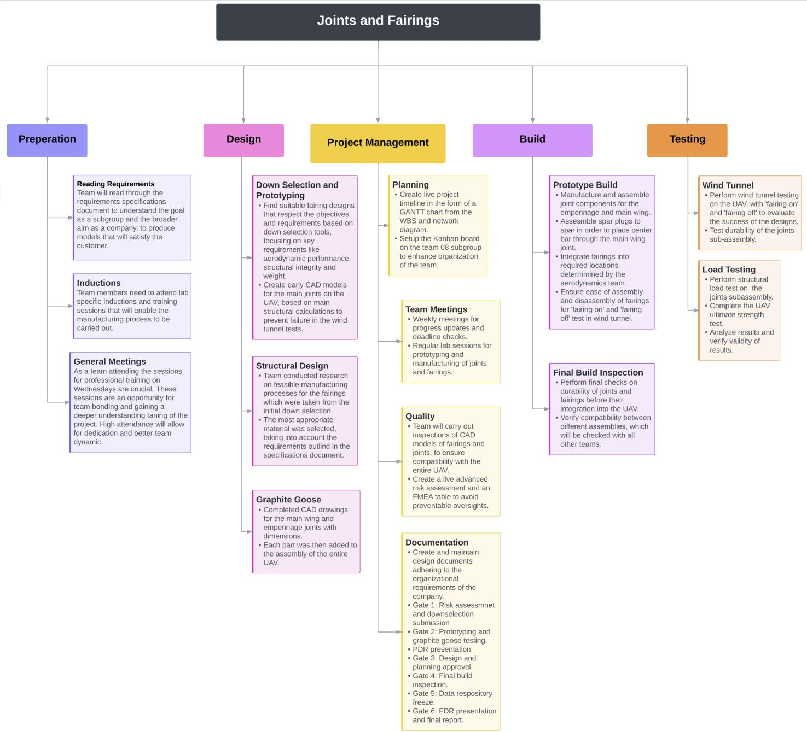</td>
<td width="50%">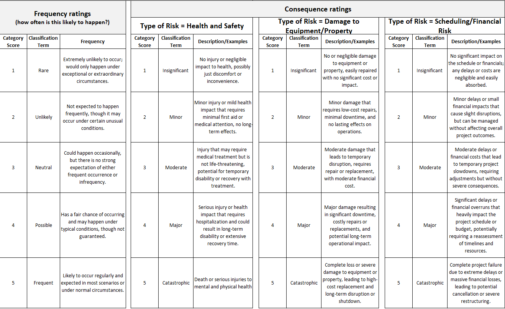</td>
</tr>
<tr>
<td align="center"><sub>Work breakdown structure</sub></td>
<td align="center"><sub>Risk rating matrix</sub></td>
</tr>
</table>

<details>
<summary><b>Gantt charts, network diagrams and the risk register</b> (click to expand)</summary>

<table>
<tr>
<td width="50%">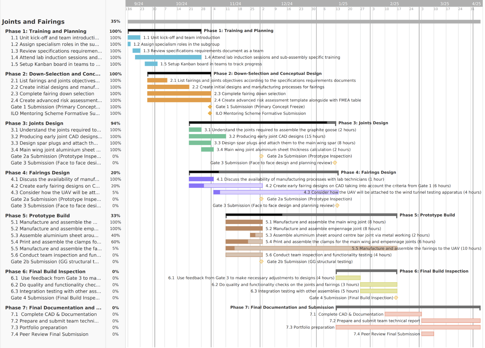</td>
<td width="50%">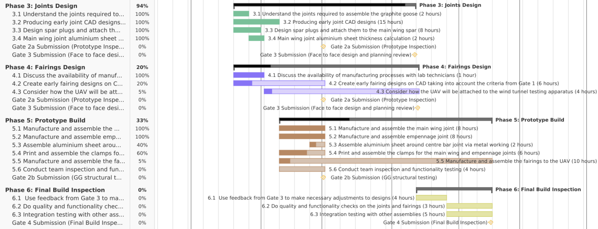</td>
</tr>
<tr>
<td align="center"><sub>Full academic year</sub></td>
<td align="center"><sub>Design and build phase</sub></td>
</tr>
<tr>
<td>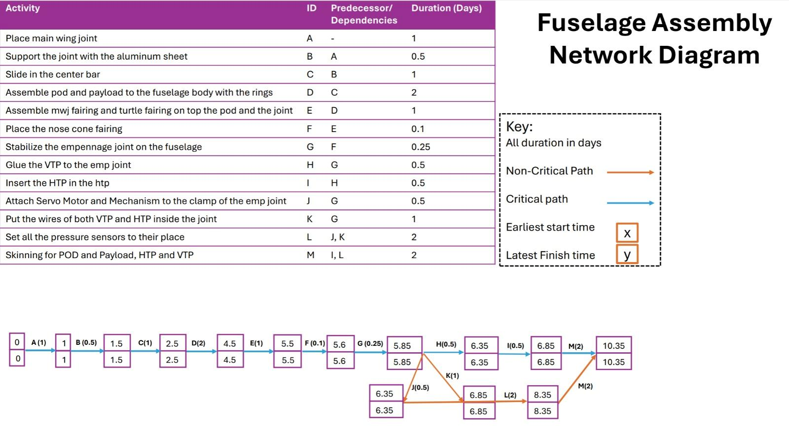</td>
<td>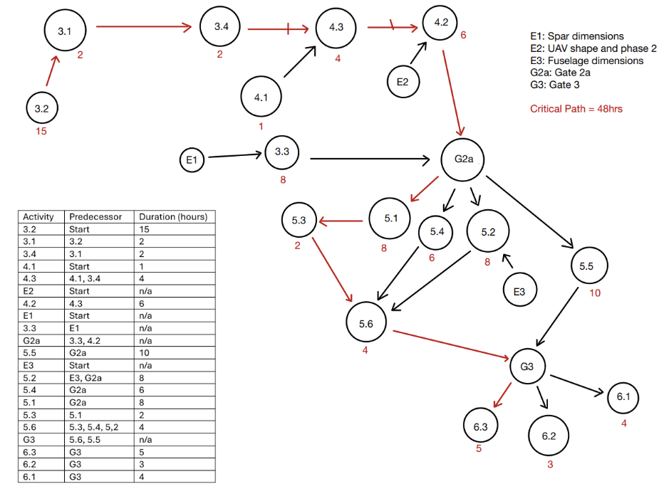</td>
</tr>
<tr>
<td align="center"><sub>Company-level critical path</sub></td>
<td align="center"><sub>Team-level critical path</sub></td>
</tr>
</table>

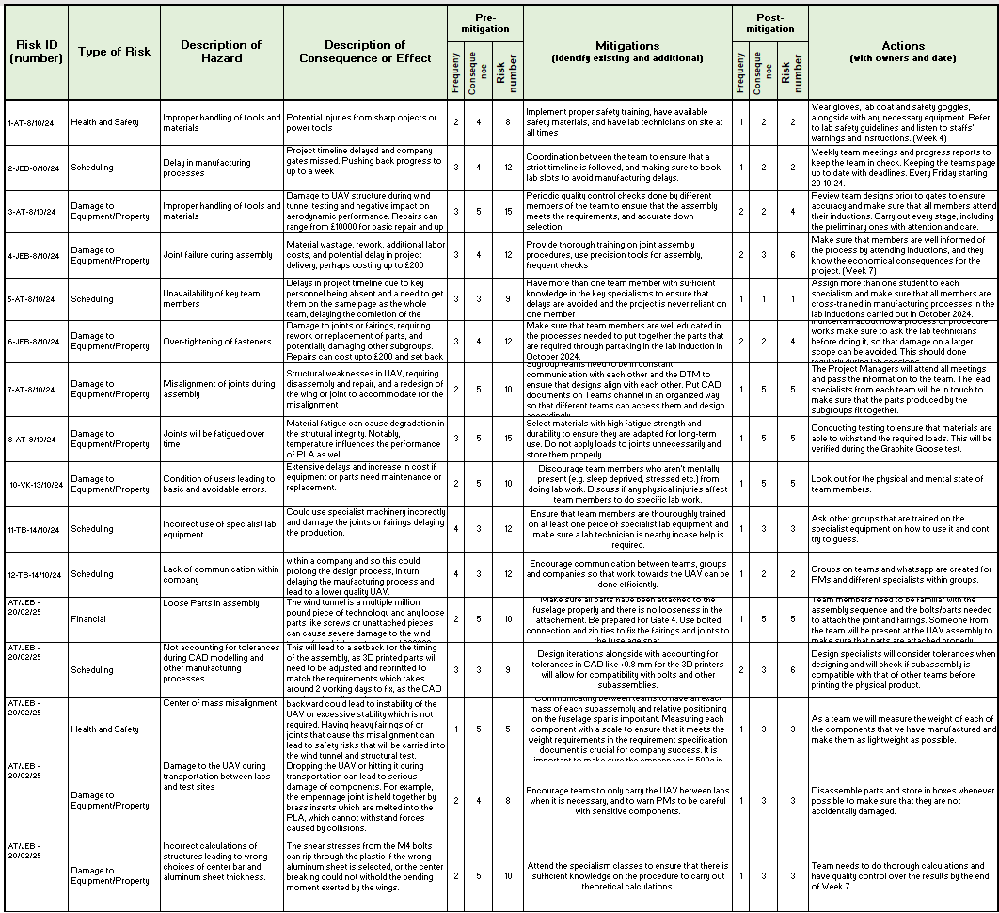

</details>

→ [Project management & risk](docs/08-project-management-and-risk.md) · [Lessons learned](docs/09-lessons-learned.md)

---

## Documentation

| # | Page | What it covers |
|---|---|---|
| 01 | [Brief & requirements](docs/01-brief-and-requirements.md) | Mission, load cases, and a full requirements traceability matrix |
| 02 | [Concept selection](docs/02-concept-selection.md) | Pairwise criteria weighting, MCDA, and the designs that were rejected |
| 03 | [Detailed design](docs/03-detailed-design.md) | Every joint, clamp and fairing — geometry, load path, interfaces |
| 04 | [Structural analysis](docs/04-structural-analysis.md) | Load cases, reserve factors, centre-bar sizing, the aluminium strap |
| 05 | [Aerodynamics](docs/05-aerodynamics.md) | XFoil vs tunnel, drag decomposition, why the fairing is shaped that way |
| 06 | [Manufacturing & integration](docs/06-manufacturing-and-integration.md) | Additive process, tolerance stack-ups, brass inserts, the CAD rebuild |
| 07 | [Test campaign](docs/07-test-campaign.md) | Graphite Goose, ultimate load test, wind tunnel entry, failure analysis |
| 08 | [Project management & risk](docs/08-project-management-and-risk.md) | WBS, Gantt, critical path vs actual, the risk register |
| 09 | [Lessons learned](docs/09-lessons-learned.md) | An honest retrospective, including what the design reviews got right |
| — | [My contribution](docs/my-contribution.md) | Scope of my own work across four roles |

---

## Repository layout

```
├── cad/            Inventor 2024 native model — full UAV, 535 files
│                   └── see cad/README.md for the part index and who drew what
├── docs/           The engineering write-up, above
├── analysis/
│   ├── data/       Source data as CSV, each with a provenance header
│   └── scripts/    make_charts.py — regenerates every chart from that data
├── figures/        CAD renders, test photography, report figures, charts
│                   └── see figures/README.md for the figure index
└── reference/      Issued test plan and drawing samples
```

### Reproducing the analysis

Every derived chart in `figures/charts/` is generated from the CSVs in `analysis/data/`.
Nothing is hand-drawn:

```bash
pip install matplotlib numpy
python analysis/scripts/make_charts.py
```

Each CSV carries a header stating where its numbers came from and how much they can be
trusted — measured, quoted from the report, or digitised off a plot.
`load_deflection.csv` is digitised and says so; treat it as a stiffness fit, not as primary
measurement.

### Tests

```bash
pip install pytest
python -m pytest analysis/scripts/
```

The suite checks that every dataset parses and records its own provenance, that the
headline numbers quoted above are actually the ones in the data (1,011 g total, RF 1.95 on
the centre bar, the 74 / 102 N/mm stiffnesses), that every row of the mass table is
internally consistent, and that each chart still regenerates. It also asserts that the
digitised load-deflection curve stops at 540 N — so it can never be mistaken for, or quoted
as, the 813 N ultimate load result.

---

## Tools

Autodesk Inventor 2024 · XFoil · Bambu Studio / FDM (PLA) · Python (matplotlib, numpy) ·
low-speed wind tunnel with a six-component balance · LabVIEW load and deflection acquisition

---

## Notes on this repository

- **Team work, individually documented.** The subassembly was delivered by six people. This
  repository is written from my own vantage point and my contribution is scoped explicitly
  in [`docs/my-contribution.md`](docs/my-contribution.md); teammates are referred to by role
  rather than by name, since they did not consent to publication.
- **Other teams' CAD is included** so the top-level assembly resolves. Authorship is
  attributed per-tree in [`cad/README.md`](cad/README.md).
- **Two photographs were altered for privacy** and one report figure excluded for
  copyright. Both are recorded in [`figures/README.md`](figures/README.md).
- Figures are reproduced from Team 08's own technical report. Third-party teaching material
  that appeared in that report has been left out.

## Licence

Documentation and figures: [CC BY-NC 4.0](LICENSE). CAD geometry is coursework produced
under University of Bristol supervision and is published here for portfolio purposes —
please do not submit it as your own work. To cite this work, see
[`CITATION.cff`](CITATION.cff).

---

<div align="center">

**Jad El Badaoui** · BEng Aerospace Engineering, University of Bristol

</div>
