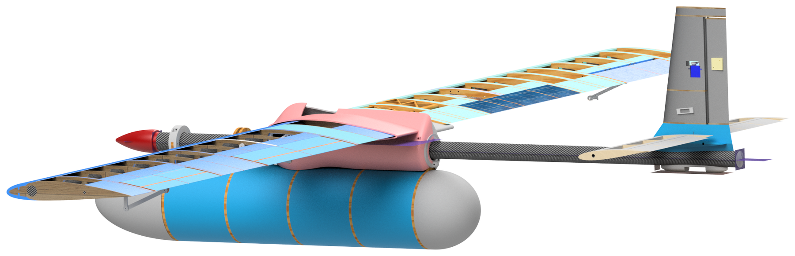
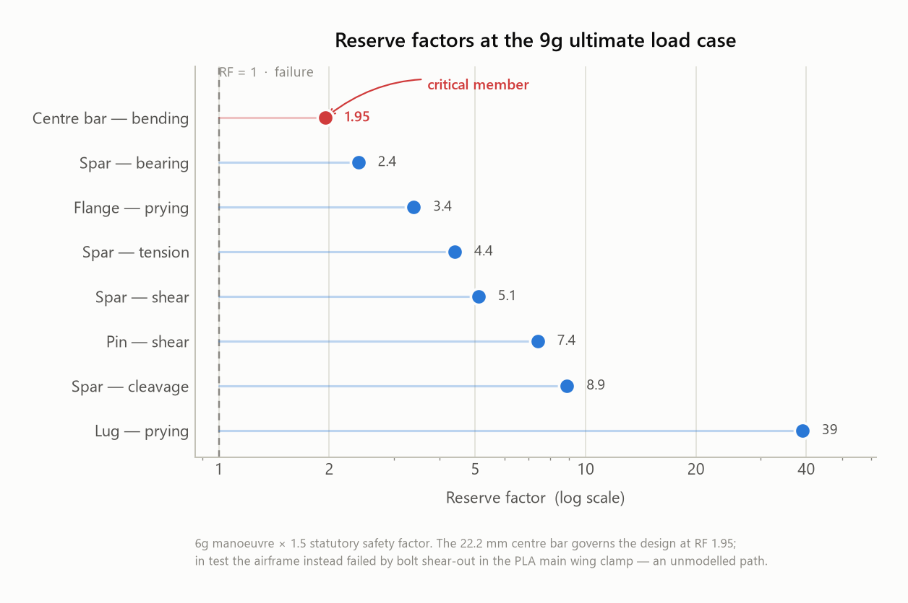
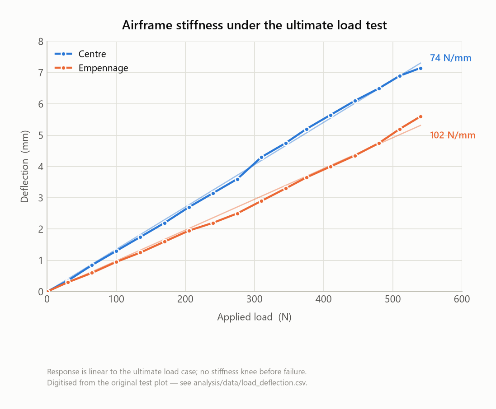

# Blood-Transport UAV — Joints & Fairings Subassembly

**AVDASI 2 · University of Bristol · Department of Aerospace Engineering · 2024–25**
Albatross Aviation (Company A) · Team 08 · Fuselage Division



*Full-vehicle CAD assembly. The pink structure over the wing root is the
Fus-MWP fairing; the joint beneath it, the empennage joint at the tail and every
fairing on the aircraft are this team's work.*

---

## The brief

Design, build and test a UAV capable of moving blood samples rapidly between a
rural short tarmac runway and a hospital test centre — the outbound leg is
time-critical, the return by road is not. Sixty students, three competing
companies, one academic year, and a real test campaign at the end: a wind tunnel
entry for aerodynamic data and a load test taken past the ultimate load case.

Team 08 owned the **joints and fairings** — every structural interface that
holds the aircraft together, and every aerodynamic surface that covers those
interfaces. That put us downstream of six other teams and upstream of the whole
airframe: nothing assembled until our parts fit.

**My role:** Fuselage Division Design Team Manager, Team Project Manager, Aero
Specialist and Design Specialist. → [What I personally did](docs/my-contribution.md)

---

## Results at a glance

| | |
|---|---|
| **Ultimate load test** | Survived to **813 N**, past the required ultimate load case |
| **Load response** | Linear throughout — **74 N/mm** centre, **102 N/mm** empennage, no stiffness knee |
| **Governing reserve factor** | **1.95** — 22.2 mm centre bar in bending, at 6g × 1.5 |
| **Observed failure** | Bolt shear-out through the PLA main wing clamp — *an unmodelled path* |
| **Wind tunnel** | 20 m/s; fairings added **+0.09 N** drag, inside the 0.34 N run-to-run scatter |
| **Subassembly mass** | **1,011 g** across 10 parts; fairings were 11.85% of all-up UAV mass |
| **Parts delivered** | 10 flight parts, 100% additively manufactured |

<table>
<tr>
<td width="50%"></td>
<td width="50%"></td>
</tr>
</table>

The headline engineering result is the gap between those last two rows of the
first table. The stress work predicted the centre bar would go first. It didn't
— the aircraft failed somewhere the analysis never looked, because no reserve
factor had been computed for any 3D-printed part. That finding, and what it
says about where analysis boundaries get drawn, is the most useful thing in this
repository. It is worked through in
[**Structural analysis**](docs/04-structural-analysis.md) and
[**Test campaign**](docs/07-test-campaign.md).

---

## Documentation

| # | Page | What it covers |
|---|---|---|
| 01 | [Brief & requirements](docs/01-brief-and-requirements.md) | Mission, load cases, and a full requirements traceability matrix |
| 02 | [Concept selection](docs/02-concept-selection.md) | Pairwise criteria weighting, MCDA, and the designs that were rejected |
| 03 | [Detailed design](docs/03-detailed-design.md) | Every joint, clamp and fairing — geometry, load path, interfaces |
| 04 | [Structural analysis](docs/04-structural-analysis.md) | Load cases, reserve factors, centre-bar sizing, the aluminium strap |
| 05 | [Aerodynamics](docs/05-aerodynamics.md) | XFoil vs tunnel, drag decomposition, why the fairing is shaped that way |
| 06 | [Manufacturing & integration](docs/06-manufacturing-and-integration.md) | Additive process, tolerance stack-ups, brass inserts, the CAD rebuild |
| 07 | [Test campaign](docs/07-test-campaign.md) | Graphite Goose, ultimate load test, wind tunnel entry, failure analysis |
| 08 | [Project management & risk](docs/08-project-management-and-risk.md) | WBS, Gantt, critical path vs actual, the risk register |
| 09 | [Lessons learned](docs/09-lessons-learned.md) | An honest retrospective, including what the design reviews got right |
| — | [My contribution](docs/my-contribution.md) | Scope of my own work across four roles |

---

## Repository layout

```
├── cad/            Inventor 2024 native model — full UAV, 535 files
│                   └── see cad/README.md for the part index and who drew what
├── docs/           The engineering write-up, above
├── analysis/
│   ├── data/       Source data as CSV, each with a provenance header
│   └── scripts/    make_charts.py — regenerates every chart from that data
├── figures/        CAD renders, test photography, report figures, charts
└── reference/      Issued test plan and drawing samples
```

### Reproducing the analysis

Every derived chart in `figures/charts/` is generated from the CSVs in
`analysis/data/`. Nothing is hand-drawn:

```bash
pip install matplotlib numpy
python analysis/scripts/make_charts.py
```

Each CSV carries a header stating where its numbers came from and how much they
can be trusted — measured, quoted from the report, or digitised off a plot.
`load_deflection.csv` is digitised and says so; treat it as a stiffness fit, not
as primary measurement.

---

## Tools

Autodesk Inventor 2024 · XFoil · Bambu Studio / FDM (PLA) · Python (matplotlib,
numpy) · low-speed wind tunnel with a six-component balance · LabVIEW load and
deflection acquisition

---

## Notes on this repository

- **Team work, individually documented.** The subassembly was delivered by six
  people. This repository is written from my own vantage point and my
  contribution is scoped explicitly in
  [`docs/my-contribution.md`](docs/my-contribution.md); teammates are referred
  to by role rather than by name, since they did not consent to publication.
- **Other teams' CAD is included** so the top-level assembly resolves.
  Authorship is attributed per-tree in [`cad/README.md`](cad/README.md).
- Figures are reproduced from Team 08's own technical report. Third-party
  teaching material that appeared in that report has been left out.

## Licence

Documentation and figures: [CC BY-NC 4.0](LICENSE). CAD geometry is coursework
produced under University of Bristol supervision and is published here for
portfolio purposes — please do not submit it as your own work.

**Jad El Badaoui** · MEng Aerospace Engineering, University of Bristol
