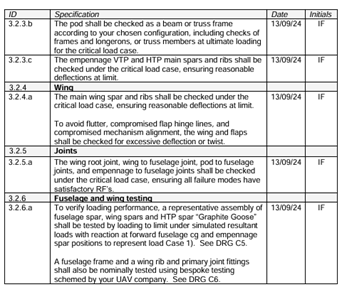

# 01 · Brief and Requirements

[← Back to overview](../README.md) · [Next: Concept selection →](02-concept-selection.md)

---

## The mission

Albatross Aviation was commissioned to produce a UAV that transports blood
samples for emergency use. Three constraints shaped everything downstream:

1. **Short rural tarmac runways.** Take-off performance is limited, so all-up
   mass is a first-order design driver rather than a nice-to-have.
2. **The outbound leg is time-critical; the return by road is not.** The
   vehicle is optimised for speed to the test centre. Minimising drag is
   therefore the dominant aerodynamic objective — not endurance, not glide
   ratio.
3. **The airframe must survive a real load test.** Predictions made in the first
   teaching block were checked against a physical test taken past the ultimate
   load case, and against a wind tunnel entry.

That second point is what justifies the fairings existing at all, and it is the
argument this subassembly is ultimately judged on. It is developed in
[Aerodynamics](05-aerodynamics.md).

## Where Team 08 sat

The company was divided into subassembly teams. Team 08 owned **joints and
fairings** within the fuselage division:

- every **structural interface** between major assemblies — wings to fuselage,
  empennage to fuselage
- every **aerodynamic fairing** covering those interfaces, plus the nose cone
  and payload ring coverings

This is a structurally awkward position in a project. The joints cannot be
dimensioned until the wing, empennage, pod and avionics teams have fixed their
own geometry, and none of those teams can assemble anything until the joints
exist. Team 08 was last in the design queue and first in the build queue. Most
of the schedule pathology described in
[Project management & risk](08-project-management-and-risk.md) follows directly
from that.

---

## Load cases

Structural checks were run against a **6g gust or manoeuvre case**, multiplied
by the standard aerospace **1.5 safety factor**, giving an effective **9g**
design case:

```
F_design = 9 × F_1g
```

Two consequences worth stating plainly:

- The checks are deliberately conservative. A reserve factor near 2 at 9g is
  not a marginal design.
- The conservatism was doing more work than intended, because several inputs
  (lift distribution, centre of mass) were themselves approximations. See
  [Structural analysis](04-structural-analysis.md) for the assumptions and their
  effect.

---

## Requirements traceability matrix

The requirements below are the ones levied specifically on this subassembly,
traced through to how each was verified and what the outcome was. `RS` refers
to the company requirement specification document.

| ID | Requirement (abridged) | Design response | Verification | Outcome |
|---|---|---|---|---|
| **2.5.1.a** | The wing spars shall be held horizontal without inducing unwanted pitch angles | Fus-MWP joint bored for a friction fit on the aluminium centre bar, tolerance stack computed for the fit | Trial assembly + Graphite Goose | **Met** — no measurable incidence error |
| **2.5.1.b** | HTP main and false rear spars shall be retained | Friction-fit pockets in the Emp-Fus joint, sized with printer allowance | Trial assembly | **Met**, with rework — printed material left in the bore had to be sanded out |
| **2.5.2.a** | 3D printed plastic may act as a joint fitting former but shall not be relied on for significant load transfer; highly loaded formers shall be reinforced with 2014A-T3 sheet straps or bearing plates | Formed 2014A-T3 strap over the Fus-MWP joint to take bolt bearing loads | Ultimate load test | **Partially met** — the strap protected the *upper* joint as intended, but the **lower clamp was left unreinforced and is where the aircraft failed**. See [Test campaign](07-test-campaign.md) |
| **2.6.1.a** | Fairings shall cover the gaps and sharp edges created by the main wing and empennage joints, to avoid flow separation and the drag that follows | Fus-MWP fairing shaped to the NACA 2414 section and extended over the exposed spar; Emp-Fus joint shaped to act as its own fairing | Wind tunnel entry | **Met geometrically**; aerodynamic benefit **not demonstrable** in the tunnel configuration available — see [Aerodynamics](05-aerodynamics.md) |
| **2.6.2.a** | Fairings shall be Styrofoam, plastic moulding or 3D printed plastic | 100% FDM PLA | Material declaration | **Met** — but the choice cost mass; see [Lessons learned](09-lessons-learned.md) |
| **3.2.5.a** | Wing root, wing-to-fuselage, pod-to-fuselage and empennage-to-fuselage joints shall be checked at the critical load case with satisfactory reserve factors for all failure modes | Eight analytical checks at 9g | TB-1 stress report, validated by ultimate load test | **Met for every mode analysed.** The caveat is *"all failure modes"* — shear-out in printed plastic was not among them |
| **3.2.6.a** | A representative "Graphite Goose" assembly shall be loaded to limit under simulated resultant loads, with reactions at the forward fuselage CG and empennage spar positions | Full joint set built and loaded | Graphite Goose test, TB-1 | **Met** — behaved as predicted |

### Reading the matrix honestly

Six of seven requirements were met. The two entries that are not clean passes
are the interesting ones, and they are related:

- **2.5.2.a** was satisfied *in letter* — a 2014A-T3 strap was fitted — but the
  requirement's intent is that *every* highly loaded printed former gets
  reinforcement. The bottom clamp was highly loaded and got none.
- **3.2.5.a** required "all failure modes" to be checked. The failure modes
  enumerated were the classical metallic ones from the taught stress methods:
  bearing, tension, shear, cleavage, prying, bending. None of them describe a
  steel bolt pulling through an anisotropic FDM part.

Both gaps have the same root: the analysis inherited a *material* assumption
from its method. The checks were metal-joint checks, applied to an aircraft
whose critical members were printed plastic.



*Extract from the issued requirement specification showing the §3.2 structural
verification clauses.*

---

[← Back to overview](../README.md) · [Next: Concept selection →](02-concept-selection.md)
